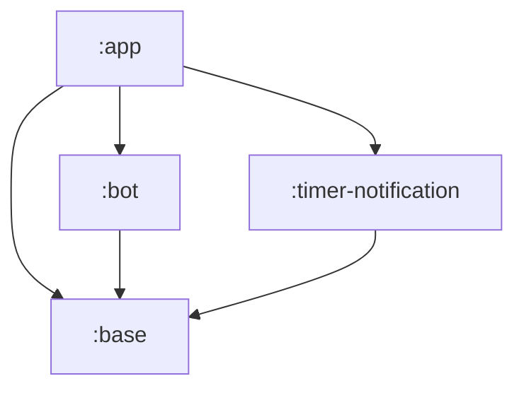
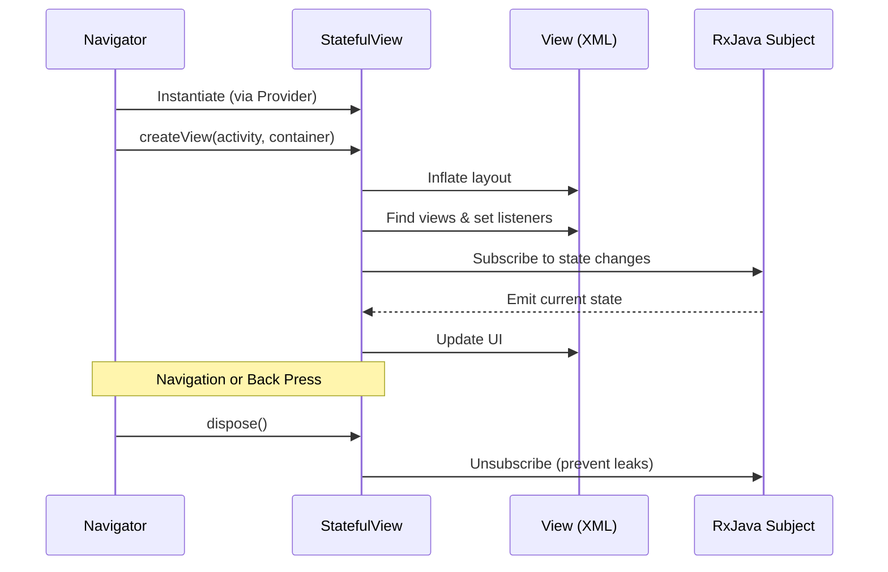
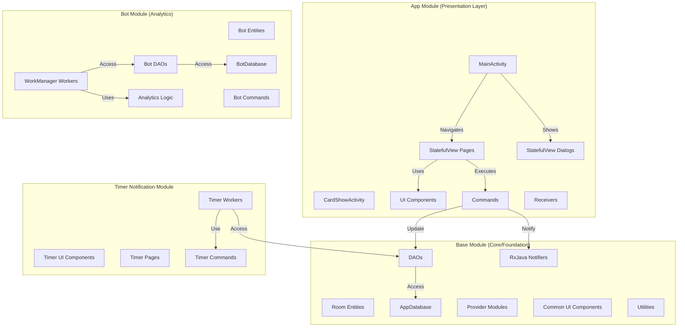
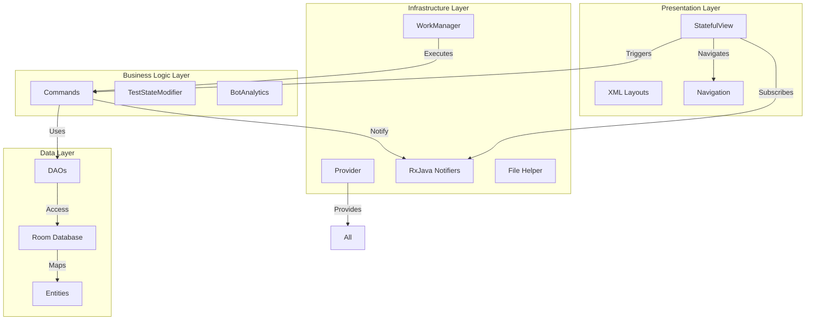
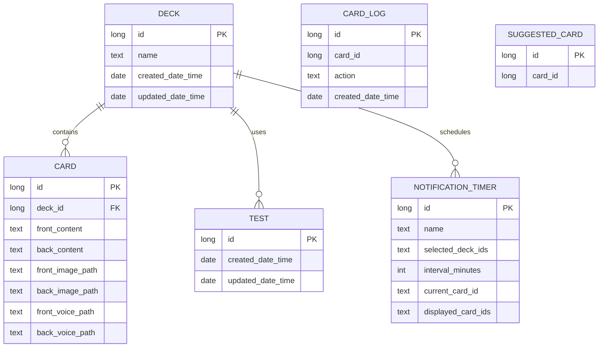
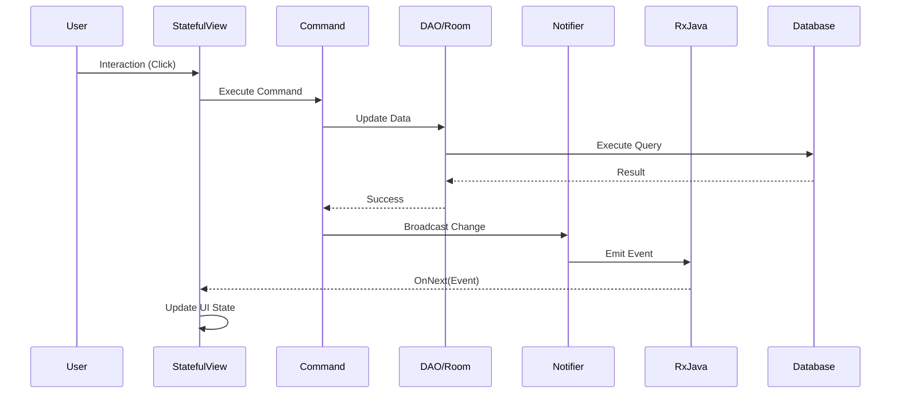
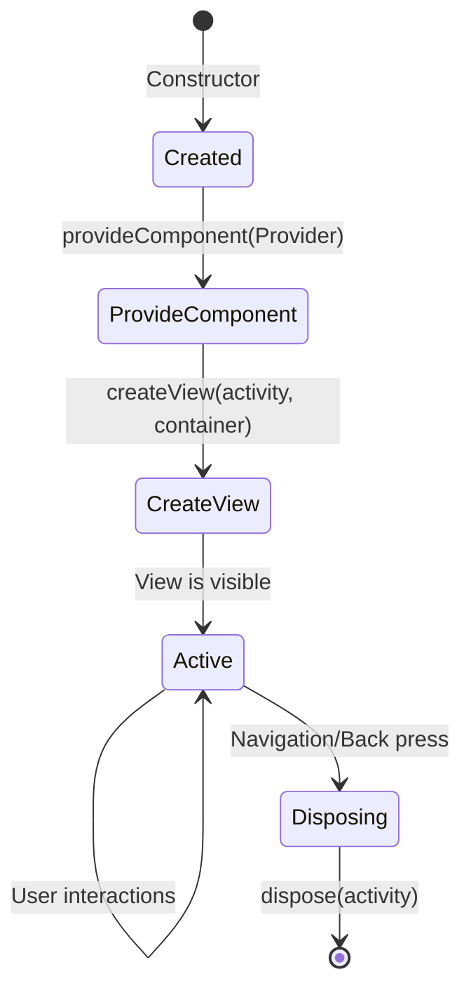

# a-flash-deck


A simple and easy to use flash card app to help you study.

## Screenshots


## Features
* Easily add deck and cards
* Add notification timer to periodically asking you question
* Support dark mode and light mode
* Easily export & share your decks to your friends
* Record voices and attach images for the cards
* Create shortcut to show random card from deck for casual study (Android 8 and above)
* Flash bot to smartly suggest list of card to test you

## Project Structure

This project is a multi-module Android application.



*   `:app`: The main application module that contains the UI and presentation layer.
*   `:base`: A library module that contains base classes and utilities shared across other modules.
*   `:bot`: A library module that contains the logic for the "Flash bot" feature.
*   `:timer-notification`: A library module for handling timer-based notifications.

This project is intended for demo app for [a-navigator](https://github.com/rh-id/a-navigator) and [a-provider](https://github.com/rh-id/a-provider) library usage. The app still works as production even though it is demo app.

## Architecture

The app follows a modern Android architecture, utilizing a combination of established libraries and custom frameworks to create a modular and maintainable codebase.

*   **Dependency Injection**: The app uses a custom service locator pattern with the `a-provider` library. A global `Provider` is initialized in the `MainApplication` class, which is then used to provide dependencies throughout the app. This creates a centralized and easy-to-manage dependency graph.

*   **Navigation**: Navigation between screens is handled by the `a-navigator` library. This library provides a flexible and powerful way to manage navigation, including support for different screen types and transitions.

*   **Reactive Programming**: The app makes extensive use of `RxJava` for handling asynchronous operations and UI events. This allows for a more concise and readable code, especially when dealing with complex asynchronous workflows.

*   **Modular Design**: The app is divided into several modules, each with a specific responsibility. This promotes a clean separation of concerns and makes the codebase easier to understand and maintain.

*   **Error Handling**: A global exception handler is set up in `MainApplication` to log crashes and other unexpected errors. This helps to ensure that the app is as stable as possible.

*   **Background Jobs**: Background tasks are handled by `WorkManager`, with a custom configuration provided by `MainApplication`. This allows for efficient and reliable execution of background tasks, such as syncing data or sending notifications.

### Presentation Layer: The `StatefulView` Pattern

The presentation layer is built on a custom component-based architecture centered around the `StatefulView` class. This pattern deviates from traditional MVP or MVVM in favor of a more self-contained and reactive approach.

Here's a breakdown of the workflow:

*   **View and Logic Combined**: `StatefulView` classes (e.g., `HomePage`, `SettingsPage`) are responsible for both creating the Android `View` and handling the presentation logic. This makes each `StatefulView` a self-contained UI component.

*   **Lifecycle**: The `a-navigator` library manages the lifecycle of `StatefulView`s. When you navigate to a new screen, the navigator creates the corresponding `StatefulView` instance. The `dispose` method is then called when the view is no longer needed, which is crucial for unsubscribing from RxJava streams and preventing memory leaks.

*   **Dependency Injection**: Dependencies are injected in two ways:
    1.  The navigator injects navigation-related components (like `INavigator` and `AppBarSV`) using the `@NavInject` annotation.
    2.  Other dependencies (like data sources, commands, and notifiers) are provided by the `a-provider` service locator via the `provideComponent` method.

*   **UI Creation**: The `createView` method is where the UI is constructed. It inflates an XML layout, finds `View`s by their IDs, and sets up event listeners. It also subscribes to RxJava streams to react to state changes.

*   **State Management and Reactivity**: The UI state is managed using RxJava's `BehaviorSubject`. The UI elements subscribe to these subjects, so whenever the state changes (e.g., a test starts or stops), the UI updates automatically and reactively.

*   **User Interaction**: User actions, handled in methods like `onClick`, trigger business logic by calling command classes (e.g., `mNewCardCmd`, `mTestStateModifier.startTest`). These commands perform operations and update the state, which in turn updates the UI through the reactive streams.



## Technical Architecture Details

### Module Organization

The project follows a modular architecture with clear separation of concerns:



### Layered Architecture



### Dependency Injection (a-provider)

The app uses a custom service locator pattern through the `a-provider` library:

- **Provider Initialization**: Created in `MainApplication.onCreate()` as the root `Provider`
- **Module Registration**: Dependencies are registered via `ProviderModule` implementations
- **Registration Types**:
  - `register()`: Synchronous singleton registration
  - `registerAsync()`: Asynchronous singleton registration (runs in background)
  - `registerLazy()`: Lazy singleton (created on first use)
  - `registerPool()`: Pool registration (creates new instances)
- **Nested Providers**: Activities create nested providers with additional modules
- **Disposal**: Automatic cleanup on app exit

### Navigation (a-navigator)

Navigation is managed by the `a-navigator` library:

- **Route-Based Navigation**: Uses string route constants defined in `Routes` class
- **Two Activities**:
  - `MainActivity`: Main app navigation hub
  - `CardShowActivity`: Dedicated activity for card display shortcuts
- **Route Registration**: Routes map to `StatefulView` factories in `NavigatorProvider`
- **Navigation Stack**: Maintains history for back navigation
- **Transition Support**: Handles screen transitions and animations

### Data Persistence

The app uses Room Persistence Library with two databases:

#### AppDatabase (base module)
- **Entities**:
  - `Deck`: Collection of flash cards
  - `Card`: Individual flash card with front/back content
  - `Test`: Test session tracking
  - `AndroidNotification`: Notification history
  - `NotificationTimer`: Scheduled notification timers
- **Version**: 11 (with migrations defined in `DbMigration`)

#### BotDatabase (bot module)
- **Entities**:
  - `CardLog`: Tracks user interactions with cards
  - `SuggestedCard`: Cards suggested by the flash bot
- **Version**: 1

#### Database Schema


### Reactive Data Flow

The app implements a reactive unidirectional data flow:



### Command Pattern Implementation

Business logic is encapsulated in command classes following the Command pattern:

**Key Commands**:
- `NewDeckCmd` / `UpdateDeckCmd` / `DeleteDeckCmd`: Deck management
- `NewCardCmd` / `UpdateCardCmd` / `DeleteCardCmd`: Card management
- `CopyCardCmd` / `MoveCardCmd`: Card operations
- `ExportImportCmd`: Deck import/export
- `PagedDeckItemsCmd` / `PagedCardItemsCmd`: Pagination
- `DeleteSuggestedCardCmd`: Bot suggestion management

**Command Flow**:
1. Command receives input from `StatefulView`
2. Validates input
3. Executes on background thread using `ExecutorService`
4. Updates database via DAO
5. Notifies changes via `RxJava` notifiers
6. Returns `Single<T>` reactive type

### RxJava Notifiers

Notifiers act as event hubs for data changes:

- **DeckChangeNotifier**: Emits events for deck/card CRUD operations
- **TestChangeNotifier**: Emits test session events (start, stop, state change)
- **NotificationTimerChangeNotifier**: Emits timer configuration changes
- **NotificationTimeChangeNotifier**: Emits notification time settings changes
- **SuggestedCardChangeNotifier**: Emits flash bot suggestion changes

Each notifier provides `Flowable<T>` streams for subscription.

### Background Processing

WorkManager is used for background tasks:

**Key Workers**:
- `NotificationTimerWorker`: Executes scheduled card notifications
  - Validates time boundaries (start/end times)
  - Selects random cards from configured decks
  - Updates displayed card history
  - Posts Android notification
- `BotAnalyzeWorker`: Analyzes user behavior to suggest cards
  - Tracks card interactions over 3 days
  - Calculates scores based on notification opens, test answers
  - Suggests cards with scores >= 3
- `BotLogCleanerWorker`: Cleans up old card logs

### Threading Strategy

Thread management ensures UI responsiveness:

- **Main Thread**: UI updates, view inflation, event handling
- **ExecutorService**: Database operations, command execution
- **ScheduledExecutorService**: Scheduled tasks
- **WorkManager**: Background job execution
- **RxJava Schedulers**:
  - `AndroidSchedulers.mainThread()`: UI updates
  - `ExecutorService` via `fromFuture()`: Background operations
  - `subscribeOn()` / `observeOn()`: Thread control

### Module Dependencies

```
app
├── implementation project(':base')
├── implementation project(':timer-notification')
├── implementation project(':bot')

timer-notification
└── implementation project(':base')

bot
└── implementation project(':base')
```

### File Structure

```
app/src/main/java/m/co/rh/id/a_flash_deck/app/
├── MainActivity.java
├── CardShowActivity.java
├── MainApplication.java
├── provider/
│   ├── AppProviderModule.java
│   ├── CommandProviderModule.java
│   ├── NavigatorProvider.java
│   ├── StatefulViewProvider.java
│   ├── command/
│   ├── component/
│   └── modifier/
├── ui/
│   ├── page/ (StatefulView pages)
│   └── component/ (UI components)
└── receiver/ (Broadcast receivers)

base/src/main/java/m/co/rh/id/a_flash_deck/base/
├── entity/ (Room entities)
├── dao/ (Data access objects)
├── room/ (Database configuration)
├── provider/
│   ├── BaseProviderModule.java
│   ├── DatabaseProviderModule.java
│   ├── RxProviderModule.java
│   └── notifier/ (RxJava notifiers)
├── component/ (Shared components)
├── constants/ (Constants, routes, keys)
└── ui/component/common/ (Common UI components)

bot/src/main/java/m/co/rh/id/a_flash_deck/bot/
├── entity/ (Bot entities)
├── dao/ (Bot DAOs)
├── room/ (Bot database)
├── provider/
│   ├── BotProviderModule.java
│   ├── component/BotAnalytics.java
│   └── notifier/
└── workmanager/ (Bot workers)

timer-notification/src/main/java/m/co/rh/id/a_flash_deck/timer/
├── provider/
│   └── command/ (Timer commands)
├── ui/
│   ├── page/ (Timer pages)
│   └── component/ (Timer components)
└── workmanager/ (Timer worker)
```

### StatefulView Lifecycle



### Key Components

**Core Components**:
- `Provider`: Service locator for dependency injection
- `INavigator`: Navigation controller
- `StatefulView`: Self-contained UI component with logic
- `AppBarSV`: Common app bar component
- `RxDisposer`: Manages RxJava subscriptions

**Data Components**:
- `AppDatabase`: Main Room database
- `BotDatabase`: Bot analytics database
- DAOs: Data access interfaces
- Entities: Room database tables

**Business Components**:
- Commands: Business logic operations
- Modifiers: State modifiers (e.g., `TestStateModifier`)
- Notifiers: RxJava event publishers

### Build Configuration

- **Gradle Plugin**: Android Gradle Plugin 8.13.2
- **Compile SDK**: 36
- **Min SDK**: 23
- **Target SDK**: 36
- **Java Version**: 1.8 (with desugaring support)
- **Kotlin**: Not used (pure Java project)
- **Room Version**: 2.8.4
- **WorkManager Version**: 2.11.0
- **a-navigator Version**: v0.0.68

### Testing

The project includes both unit and instrumentation tests, although the coverage could be improved. Here's a summary of the testing strategy:

*   **Unit Tests**: The project has a `unitTest` artifact, but it currently only contains a boilerplate example. This is an area for improvement, as the business logic in the command classes and other components could be unit-tested with mocked dependencies.

*   **Instrumentation Tests**: The project has an `androidTest` artifact with at least one meaningful test, `ExportImportCmdTest.java`. This test demonstrates a good approach to testing database interactions and file operations, using a separate `Provider` and an in-memory database to ensure that tests are hermetic and isolated.

*   **Areas for Improvement**: In addition to adding more unit tests, the project would benefit from UI tests using a framework like Espresso. This would allow for the verification of the application's user interface and user flows, ensuring that the app behaves as expected from the user's perspective.

### CI/CD and Automation

The project uses a combination of GitHub Actions and Fastlane to automate the build, test, and release process.

### GitHub Actions

The project has three GitHub Actions workflows:

*   `gradlew-build.yml`: Builds the project with Gradle on every push and pull request to the `master` branch.
*   `android-release.yml`: Creates a GitHub release and attaches the debug and release APKs when a new tag starting with "v" is pushed.
*   `android-emulator-test.yml`: Runs Android instrumentation tests on an emulator on every push and pull request to the `master` branch.

### Fastlane

The project uses Fastlane to manage the app's metadata for the Google Play Store. This includes the app's title, description, screenshots, and changelogs. The metadata is stored in the `fastlane/metadata` directory and is organized by language.

## How to Build

1.  Clone the repository: `git clone https://github.com/rh-id/a-flash-deck.git`
2.  Open the project in Android Studio.
3.  Build the project using Gradle: `./gradlew assembleDebug`

## Libraries Used

The app uses [a-navigator](https://github.com/rh-id/a-navigator) framework as navigator and `StatefulView` as base structure, combined with [a-provider](https://github.com/rh-id/a-provider) library for service locator, and finally RxAndroid to handle UI use cases.

## Support this project
Consider donation to support this project
<table>
  <tr>
    <td><a href="https://teer.id/rh-id">https://teer.id/rh-id</a></td>
  </tr>
</table>
